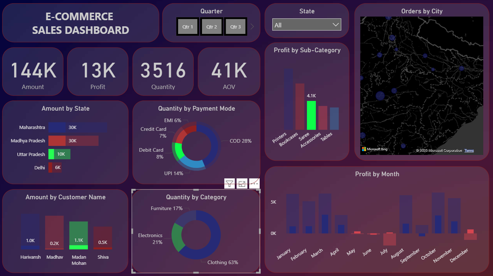

# E-Commerce Store Analysis

This project presents a Power BI dashboard built using E-commerce store data.  
It helps analyze sales performance, customer behavior, and product trends through interactive visualizations.

## Tools Used
- Microsoft Power BI

## Project Highlights
- Interactive dashboard for online sales analysis
- Insights on products, categories, and regions
- Use of filters and slicers for better exploration

## Key Learnings
- Built an interactive Power BI dashboard
- Connected and transformed data
- Used charts, filters, and slicers effectively
- Improved data analysis and visualization skills

## Screenshot

